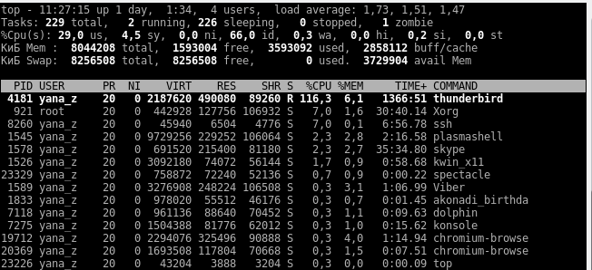

<div align="center">
  <h1> Python Справочник</h1>
  <a class="header-badge" target="_blank" href="https://www.linkedin.com/in/%D0%BF%D0%B0%D0%B2%D0%B5%D0%BB-%D0%B4%D0%B0%D0%B2%D0%B8%D0%B4%D1%87%D0%B8%D0%BA/">
  
  </a>

  <sub>Author: <a href="https://www.linkedin.com/in/%D0%BF%D0%B0%D0%B2%D0%B5%D0%BB-%D0%B4%D0%B0%D0%B2%D0%B8%D0%B4%D1%87%D0%B8%D0%BA/" target="_blank">Павел Давидчик</a>  
  <small>First editon:  February 2021</small>
  </sub>
</div>

<h1 align="center" style="color:#306998;font-size:48px;">Оглавление</h1>

[Основы](#основы)
- [Основы](#основы)
- [Переменные и типы данных](#переменные-и-типы-данных)
- [Декораторы](#декораторы)
- [Магические методы](#магические-методы)
- [Итераторы и генераторы](#итераторы-и-генераторы)
- [Контекстные менеджеры](#контекстные-менеджеры)
- [Файлы](#файлы)
- [Ошибки и исключения](#ошибки-и-исключения)
- [Процессы и потоки](#процессы-и-потоки)
- [Unittest Тестирование](#unittest-тестирование)
- [requests](#requests)
- [Регулярные выражения в Python](#регулярные-выражения-в-python)
- [JSON](#json)
- [CSV](#csv)
- [XML](#xml)

<h1 align="center" style="color:#306998;font-size:48px;">Введение</h1>

**Python** представляет популярный высокоуровневый язык программирования, который предназначен для создания приложений различных типов. Это и **веб-приложения**, и **игры**, и **настольные программы**, и работа с **базами данных**. Довольно большое распространение питон получил в области **машинного обучения** и исследований **искусственного интеллекта**.

<h1 align="center" style="color:#306998;font-size:48px;">Установка</h1>

Сперва необходимо установить [Python](https://www.python.org/downloads/).
Чтобы писать на Python, нам нужен редактор кода. Это наиболее часто используемые: 

- [Jupter Note book](https://www.anaconda.com/distribution/)
- [vscode](https://code.visualstudio.com/)
- [PyCharm](https://www.jetbrains.com/pycharm/)

<h1 align="center" style="color:#306998;font-size:48px;">Python Основы</h1>

## Основы

Программа на языке Python состоит из набора инструкций. Каждая инструкция помещается на новую строку. Например:

```python
print(2 + 3) 
print("Hello")
```

Большую роль в Python играют **отступы**. Неправильно поставленный **отступ** фактически является **ошибкой**. Например, в следующем случае мы получим ошибку, хотя код будет практически аналогичен приведенному выше:

```python
print(2 + 3) 
    print("Hello")
```

Однако стоит учитывать, что некоторые конструкции языка могут состоять из нескольких строк. Например, условная конструкция if:

```python
if 1 < 2:
    print("Hello")
```

В данном случае если 1 меньше 2, то выводится строка "Hello". И здесь уже должен быть отступ, так как инструкция print("Hello") используется не сама по себе, а как часть условной конструкции if. Причем отступ, согласно руководству по оформлению кода, желательно делать из такого количество пробелов, которое кратно 4 (то есть 4, 8, 16 и т.д.) Хотя если отступов будет не 4, а 5, то программа также будет работать.

**Python** - регистрозависимый язык, поэтому выражения print и Print или PRINT представляют разные выражения. И если вместо метода print для вывода на консоль мы попробуем использовать метод Print:

```python
Print("Hello World")
```

то у нас ничего не получится.

Для отметки, что делает тот или иной участок кода, применяются **комментарии**. При трансляции и выполнении программы интерпретатор игнорирует **комментарии**, поэтому они не оказывают никакого влияния на работу программы.

**Комментарии** в Python бывают **блочные** и **строчные**. Все они предваряются **знаком решетки (#)**.

**Блочные комментарии** ставятся в начале строки:

```python
# Вывод сообщения на консоль
print("Hello World")
```

**Строчные комментарии** располагаются на той же строке, что и инструкции языка:

```python
print("Hello World")  # Вывод сообщения на консоль
```

Python позволяет писать комментарии на нескольких строках. Они называются **многострочными**.
В Python есть такая особенность, как **задокументированные строки (docstring)**. С их помощью программисты могут быстро добавлять **комментарии для каждого модуля, функции, метода или класса в Python**. Задать **docstring** можно с помощью **строковой константы**. Она обязана быть **первой инструкцией в определении объекта**.

У **docstring** более широкая область применения, чем у комментария. Она должна описывать, что делает функция, а не как. **Хорошей практикой считается добавление таких строк в каждую функцию программы**.

Получить доступ к **docstring** можно следующим образом — **myobj.\__doc__**.

```python
def theFunction():
    '''
    Эта функция демонстрирует использование docstring в Python.
    '''
    print("docstring python не являются комментариями.")

print("\nВыведем docstring функции...")
print(theFunction.__doc__)
```

Основной функцией для вывода информации на консоль является функция **print()**. В качестве аргумента в эту функцию передается строка, которую мы хотим вывести:

```python
print("Hello Python")
```

Если же нам необходимо вывести **несколько значений** на консоль, то мы можем передать их в функцию print через запятую:

```python
print("Full name:", "Tom", "Smith")
```

В итоге все переданные значения **склеятся через пробелы** в одну строку:

```shell
Full name: Tom Smith
```

Изменить **разделитель**:

```python
print("Full name:", "Tom", "Smith", sep="---")
```

Вывод:

```shell
Full name:---Tom---Smith
```

По умолчанию в конце происходит **перевод на новую строку**. Чтобы это изменить: 

```python
print("Full name:", "Tom", "Smith", sep="---", end="!")
```

Вывод:

```shell
Full name:---Tom---Smith!
```

Если функция print отвечает за вывод, то функция **input** отвечает за **ввод информации**. В качестве необязательного параметра эта функция принимает приглашение к вводу и возвращает введенную строку, которую мы можем сохранить в переменную:

```python
name = input("Введите имя: ")
print("Привет", name)
```

Вывод:

```shell
Введите имя: Евгений
Привет Евгений
```

## Переменные и типы данных


## Декораторы

**Декоратор** — это функция, которая позволяет обернуть другую функцию для расширения её функциональности без непосредственного изменения её кода.

**Объектами первого класса** в контексте конкретного языка программирования называются элементы, с которыми можно делать всё то же, что и с любым другим объектом: передавать как параметр, возвращать из функции и присваивать переменной.

**Функции высших порядков** — это такие функции, которые могут принимать в качестве аргументов и возвращать другие функции.

Посмотрим на пример **декоратора**:

```python
def decorator_function(func):
    def wrapper():
        print('Функция-обёртка!')
        print('Оборачиваемая функция: {}'.format(func))
        print('Выполняем обёрнутую функцию...')
        func()
        print('Выходим из обёртки')
    return wrapper
```

Здесь **decorator_function()** является **функцией-декоратором**. Как вы могли заметить, она является **функцией высшего порядка**, так как принимает функцию в качестве аргумента, а также возвращает функцию. Внутри **decorator_function()** мы определили другую функцию, обёртку, так сказать, которая обёртывает функцию-аргумент и затем изменяет её поведение. **Декоратор** возвращает эту обёртку. Теперь посмотрим на **декоратор** в действии:

```python
@decorator_function
def hello_world():
    print('Hello world!')

hello_world()

Оборачиваемая функция: <function hello_world at 0x032B26A8>
Выполняем обёрнутую функцию...
Hello world!
Выходим из обёртки
```

Выражение с **@** является всего лишь синтаксическим сахаром для<br> 
**hello_world = decorator_function(hello_world)**.

Давайте взглянем на другой, более полезный **декоратор**:

```python
def benchmark(func):
    import time
    
    def wrapper():
        start = time.time()
        func()
        end = time.time()
        print('[*] Время выполнения: {} секунд.'.format(end-start))
    return wrapper

@benchmark
def fetch_webpage():
    import requests
    webpage = requests.get('https://google.com')

fetch_webpage()
```

Здесь мы создаём **декоратор**, замеряющий время выполнения функции. Далее мы используем его на функции, которая делает GET-запрос к главной странице **Google**. Чтобы измерить скорость, мы сначала сохраняем время перед выполнением обёрнутой функции, выполняем её, снова сохраняем текущее время и вычитаем из него начальное.

После выполнения кода получаем примерно такой результат:

```shell
[*] Время выполнения: 1.4475083351135254 секунд.
```

В приведённых выше примерах **декораторы** ничего не принимали и не возвращали. Модифицируем наш декоратор для измерения времени выполнения:

```python
def benchmark(func):
    import time
    
    def wrapper(*args, **kwargs):
        start = time.time()
        return_value = func(*args, **kwargs)
        end = time.time()
        print('[*] Время выполнения: {} секунд.'.format(end-start))
        return return_value
    return wrapper

@benchmark
def fetch_webpage(url):
    import requests
    webpage = requests.get(url)
    return webpage.text

webpage = fetch_webpage('https://google.com')
print(webpage)
```

Вывод после выполнения:

```shell
[*] Время выполнения: 1.4475083351135254 секунд.
<!doctype html><html itemscope="" itemtype="http://schema.org/WebPage"........
```

Как вы видите, аргументы декорируемой функции передаются функции-обёртке, после чего с ними можно делать что угодно. Можно изменять аргументы и затем передавать их декорируемой функции, а можно оставить их как есть или вовсе забыть про них и передать что-нибудь совсем другое. То же касается возвращаемого из декорируемой функции значения, с ним тоже можно делать что угодно.

Мы также можем создавать **декораторы, которые принимают аргументы**. Посмотрим на пример:

```python
def benchmark(iters):
    def actual_decorator(func):
        import time
        
        def wrapper(*args, **kwargs):
            total = 0
            for i in range(iters):
                start = time.time()
                return_value = func(*args, **kwargs)
                end = time.time()
                total = total + (end-start)
            print('[*] Среднее время выполнения: {} секунд.'.format(total/iters))
            return return_value

        return wrapper
    return actual_decorator


@benchmark(iters=10)
def fetch_webpage(url):
    import requests
    webpage = requests.get(url)
    return webpage.text

webpage = fetch_webpage('https://google.com')
print(webpage)
```

Функция **benchmark()** на первый взгляд может показаться декоратором, но на самом деле таковым **не является**. Это обычная функция, которая принимает аргумент iters, а затем возвращает декоратор. В свою очередь, он декорирует функцию **fetch_webpage()**. Поэтому мы использовали не выражение **@benchmark**, а **@benchmark(iters=10)** — это означает, что тут вызывается функция **benchmark()** (функция со скобками после неё обозначает вызов функции), после чего она возвращает сам **декоратор**.

Напоследок стоит упомянуть, что не только функции, а **любые вызываемые объекты могут быть декоратором**. Экземпляры классов/объекты с методом **\__call__()** тоже можно вызывать, поэтому их можно использовать в качестве декораторов. Эту функциональность можно использовать для создания декораторов, хранящих какое-то состояние. Например, вот **декоратор для мемоизации**:

```python
from collections import deque

class Memoized:
    def __init__(self, cache_size=100):
        self.cache_size = cache_size
        self.call_args_queue = deque()
        self.call_args_to_result = {}

    def __call__(self, fn):
        def new_func(*args, **kwargs):
            memoization_key = self._convert_call_arguments_to_hash(args, kwargs)
            if memoization_key not in self.call_args_to_result:
                result = fn(*args, **kwargs)
                self._update_cache_key_with_value(memoization_key, result)
                self._evict_cache_if_necessary()
            return self.call_args_to_result[memoization_key]
        return new_func

    def _update_cache_key_with_value(self, key, value):
        self.call_args_to_result[key] = value
        self.call_args_queue.append(key)

    def _evict_cache_if_necessary(self):
        if len(self.call_args_queue) > self.cache_size:
            oldest_key = self.call_args_queue.popleft()
            del self.call_args_to_result[oldest_key]

    @staticmethod
    def _convert_call_arguments_to_hash(args, kwargs):
        return hash(str(args) + str(kwargs))


@Memoized(cache_size=5)
def get_not_so_random_number_with_max(max_value):
    import random
    return random.random() * max_value
```

**Дополнительно**:

- **Декораторы** не обязательно должны быть функциями, это может быть любой вызываемый объект.
- **Декораторы** не обязаны возвращать функции, они могут возвращать что угодно. Но обычно мы хотим, чтобы декоратор вернул объект того же типа, что и декорируемый объект.
- Также **декораторы** могут принимать в качестве аргументов не только функции.
- Необходимость в **декораторах** может быть неочевидной до написания библиотеки. Поэтому, если декораторы кажутся вам бесполезными, посмотрите на них с точки зрения разработчика библиотеки. Хорошим примером является декоратор представления в **Flask**.
- Также стоит обратить внимание на [functools.wraps()](https://docs.python.org/3.7/library/functools.html#functools.wraps) — функцию, которая помогает сделать декорируемую функцию похожей на исходную, делая такие вещи, как сохранение **doctstring** исходной функции.

## Магические методы

**Магический метод** — это метод, определённый внутри класса, который начинается и заканчивается двумя подчёркиваниями. Например, магическим методом является метод
**\__init__**, который отвечает за инициализацию созданного объекта. Давайте определим
класс **User**, который будет переопределять магический метод **\__init__**. В нём будем записывать полученые имя и e-mail в атрибуты класса. Также определим метод, который
возвращает атрибуты класса в виде словаря. С этим вы уже должны быть знакомы:

```python
class User:
    def __init__(self, name, email):
        self.name = name
        self.email = email

    def get_email_data(self):
        return {
            'name': self.name,
            'email': self.email
        }
jane = User('Jane Doe', 'janedoe@example.com')
print(jane.get_email_data())
{'name': 'Jane Doe', 'email': 'janedoe@example.com'}
```

Ещё одним магическим методом является метод **\__new__**, в котором прописано, что
происходит в момент создания объекта класса. Метод **\__new__** возвращает только что созданный объект класса. Например, создадим класс **Singleton**, который гарантирует то,
что не может быть создано больше одного объекта данного класса. Например, мы можем
попытаться создать два объекта a и b, которые в итоге окажутся одним и тем же объектом:

```python
class Singleton:
    instance = None
    def __new__(cls):
        if cls.instance is None:
            cls.instance = super().__new__(cls)
        return cls.instance

a = Singleton()
b = Singleton()

a is b

True
```

Существует также метод **\__del__**, который определяет поведение при **удалении объекта**. Однако, он работает не всегда очевидно. Он вызывается не когда мы удаляем объект
оператором **del**, а когда количество ссылок на наш объект стало равным нулю и вызывался **garbage collector**. Это не всегда происходит тогда, когда мы думаем, что это должно
произойти, поэтому переопределять метод **\__del__** нежелательно.

Одним из магических методов является метод **\__str__**, который определяет поведение, при вызове функции **print** от класса. Метод **\__str__** должен определить человекочитаемое описание нашего класса, которое пользователь может потом вывести в интерфейсе. В следующем примере мы используем ранее написанный класс **User**, но теперь,
если мы будем принтить наш объект, у нас будет выводиться понятное и читаемое название:

```python
class User:
    def __init__(self, name, email):
        self.name = name
        self.email = email
    def __str__(self):
        return '{} <{}>'.format(self.name, self.email)

jane = User('Jane Doe', 'janedoe@example.com')
print(jane)

Jane Doe <janedoe@example.com>
```

Ещё двумя полезными методами магическими являются методы **\__hash__** и **\__eq__**,
которые определяют то, что происходит при вызове функции **hash** и как **сравниваются
объекты** соответственно. Магический метод **\__hash__** переопределяет функцию **хеширования**, которая используется, например, когда мы получаем ключи в словаре. В следующем примере мы указываем в классе **User**, что при вызове функции **hash** в качестве
хеша всегда берётся e-mail пользователя, и также при сравнении пользователей сравниваются их e-mail-ы. Таким образом, если мы создадим двух юзеров с разными именами,
но одинаковыми e-mail-ами, при вызове функции сравнения Python покажет, что это один
и тот же объект, потому что вызывается переопределённый метод **\__eq__**, который сравнивает только e-mail-ы:

```python
class User:
    def __init__(self, name, email):
        self.name = name
        self.email = email
    def __hash__(self):
        return hash(self.email)
    def __eq__(self, obj):
        return self.email == obj.email

jane = User('Jane Doe', 'jdoe@example.com')
joe = User('Joe Doe', 'jdoe@example.com')
print(jane == joe)

True
```

Точно так же функция **hash** возвращает теперь одно и то же значение, потому что сравниваются только e-mail-ы, которые в данном случае одинаковы:

```python
print(hash(jane))
print(hash(joe))

7885430882792781082
7885430882792781082
```

Также, если мы попробуем создать словарь, где в качестве ключа будут использоваться уже созданные объекты класса **User**, то создастся словарь только с одним ключом,
потому что оба объекта имеют одинаковое значение хеша:

```python
user_email_map = {user: user.name for user in [jane, joe]}
print(user_email_map)

{<__main__.User object at 0x107415908>: 'Joe Doe'}
```

Очень важными магическими методами являются **методы, определяющие доступ к атрибутам**. Это методы **\__getattr__** и **\__getattribute__**. Важно понимать отличия между ними. Итак, метод **\__getattr__** определяет поведение, когда наш атрибут, который мы
пытаемся получить, не найден. Метод **\__getattribute__** вызывается в любом случае,
когда мы обращаемся к какому-либо атрибуту объекта. Например, мы можем возвращать
всегда какую-то строчку и ничего не делать, как в следующем примере. Мы определили
класс и переопределили метод **\__getattribute__**, который всегда возвращает одну и
ту же строку. Таким образом, к какому бы атрибуту мы ни обратились, у нас всегда выведется эта строка:

```python
class Researcher:
    def __getattr__(self, name):
        return 'Nothing found :('
    def __getattribute__(self, name):
        return 'nope'

obj = Researcher()
print(obj.attr)
print(obj.method)
print(obj.DFG2H3J00KLL)

nope
nope
nope
```

**\__getattr__** вызывается в том случае, если атрибут не найден. В следующем примере внутри **\__getattribute__**, который вызывается всегда, мы логируем, что пытаемся
найти соответствующий атрибут и продолжаем выполнение, используя класс **object**, затем, если объект не найден, вызывается метод **\__getattr__**:

```python
class Researcher:
    def __getattr__(self, name):
        return 'Nothing found :()\n'
    def __getattribute__(self, name):
        print('Looking for {}'.format(name))
        return object.__getattribute__(self, name)

obj = Researcher()

print(obj.attr)
print(obj.method)
print(obj.DFG2H3J00KLL)

Looking for attr
Nothing found :()
Looking for method
Nothing found :()
Looking for DFG2H3J00KLL
Nothing found :()
```

Магический метод **\__setattr__**, как вы могли догадаться, определяет поведение при
присваивании значения к атрибуту. Например, вместо того, чтобы присвоить значение, мы
можем опять же вернуть какую-то строчку и ничего не делать. В данном случае, если мы
попытаемся присвоить значение атрибуту, у нас ничего не выйдет — атрибут не создастся:

```python
class Ignorant:
    def __setattr__(self, name, value):
        print('Not gonna set {}!'.format(name))

obj = Ignorant()
obj.math = True

Not gonna set math!

print(obj.math)
---------------------------------------------------------------------
AttributeError Traceback (most recent call last)
<ipython-input-10-677c3efbe80d> in <module>()
----> 1 print(obj.math)
AttributeError: 'Ignorant' object has no attribute 'math'
```

Наконец, метод **\__delattr__** управляет поведением при удалении атрибута объекта.
Например, его имеет смысл использовать, если мы хотим каскадно удалить объекты, связанные с нашим классом. В данном случае мы просто продолжаем удаление с помощью
класса object и логируем то, что у нас происходит удаление:

```python
class Polite:
    def __delattr__(self, name):
        value = getattr(self, name)
        print(f'Goodbye {name}, you were {value}!')
        object.__delattr__(self, name)

obj = Polite()

obj.attr = 10
del obj.attr

Goodbye attr, you were 10!
```

Ещё одним магическим методом является метод **\__call__**, который определяет поведение программы при вызове класса. Например, с помощью метода **\__call__** мы можем
определить **logger**, который будем потом использовать в качестве декоратора (да, декоратором может быть не только функция, но и класс!). В примере ниже при инициализации
класса Logger объект этого класса запоминает **filename**, который ему передан. Каждый
раз, когда мы будем вызывать наш класс, он будет возвращать новую функцию в соответствии с протоколом декораторов и записывать в лог-файл строчку о вызове функции.
В данном случае мы определяем пустую функцию, и декоратор записывает все её вызовы:

```python
class Logger:
    def __init__(self, filename):
        self.filename = filename

    def __call__(self, func):
        def wrapped(*args, **kwargs):
            with open(self.filename, 'a') as f:
                f.write('Oh Danny boy...')
            return func(*args, *kwargs)
        return wrapped

logger = Logger('log.txt')

@logger
def completely_useless_function():
    pass

completely_useless_function()

with open('log.txt') as f:
    print(f.read())

Oh Danny boy...
```

Классическим примером на перегрузку операторов в других языках программирования является перегрузка оператора сложения. В Python-е за операцию сложения отвечает оператор **\__add__** (в свою очередь, вычитание можно перегрузить с помощью метода
**\__sub__**). В качестве примера определим класс **NoisyInt**, который будет работать почти
как **integer**, но добавлять шум при сложении:

```python
import random

class NoisyInt:
    def __init__(self, value):
        self.value = value

    def __add__(self, obj):
        noise = random.uniform(-1, 1)
        return self.value + obj.value + noise

a = NoisyInt(10)
b = NoisyInt(20)

for _ in range(3):
    print(a + b)

30.605646527205856
30.170967742734117
29.071231797981817
```


## Итераторы и генераторы

**Итератор** представляет собой объект перечислитель, который для данного объекта выдает следующий элемент, либо бросает исключение **StopIteration**, если элементов больше нет.

Приведем несколько примеров, которые помогут лучше понять эту концепцию. Для начала выведем элементы произвольного списка на экран:

```python
num_list = [1, 2, 3, 4, 5]
for i in num_list:
    print(i)

1
2
3
4
5
```

 Элементы которых можно перебирать в цикле **for**, содержат в себе объект **итератор**, для того, чтобы его получить необходимо использовать функцию **iter()**, а для извлечения следующего элемента из итератора – функцию **next()**.

 ```python
itr = iter(num_list)
print(next(itr))
1
print(next(itr))
2
print(next(itr))
3
print(next(itr))
4
print(next(itr))
5
print(next(itr))
Traceback (most recent call last):
  File "<pyshell#12>", line 1, in <module>
    print(next(itr))
StopIteration
 ```

 Как видно из приведенного выше примера вызов функции **next(itr)** каждый раз возвращает следующий элемент из списка, а когда эти элементы заканчиваются, генерируется исключение **StopIteration**.

 Если нужно обойти элементы внутри объекта вашего собственного класса, необходимо построить свой **итератор**. Создадим класс, объект которого будет итератором, выдающим определенное количество единиц, которое пользователь задает при создании объекта. Такой класс будет содержать конструктор, принимающий на вход количество единиц и метод **\__next__()**, без него экземпляры данного класса не будут итераторами.

```python
class SimpleIterator:
    def __init__(self, limit):
        self.limit = limit
        self.counter = 0

    def __next__(self):
        if self.counter < self.limit:
            self.counter += 1
            return 1
        else:
            raise StopIteration

s_iter1 = SimpleIterator(3)
print(next(s_iter1))
print(next(s_iter1))
print(next(s_iter1))
print(next(s_iter1))
```

В нашем примере при четвертом вызове функции **next()** будет выброшено исключение **StopIteration**. Если мы хотим, чтобы с данным объектом можно было работать в цикле **for**, то в класс **SimpleIterator** нужно добавить метод **\__iter__()**, который возвращает итератор, в данном случае этот метод должен возвращать **self**.

```python
class SimpleIterator:
    def __iter__(self):
        return self

    def __init__(self, limit):
        self.limit = limit
        self.counter = 0

    def __next__(self):
        if self.counter < self.limit:
            self.counter += 1
            return 1
        else:
            raise StopIteration

s_iter2 = SimpleIterator(5)
for i in s_iter2:
    print(i)
```

**Генератор** – это функция, которая будучи вызванной в функции **next()** возвращает следующий объект согласно алгоритму ее работы. 

Вместо ключевого слова **return** в генераторе используется **yield**. Проще всего работу генератора посмотреть на примере. Напишем функцию, которая генерирует необходимое нам количество единиц:

```python
def simple_generator(val):
   while val > 0:
       val -= 1
       yield 1

gen_iter = simple_generator(5)
print(next(gen_iter))
print(next(gen_iter))
print(next(gen_iter))
print(next(gen_iter))
print(next(gen_iter))
print(next(gen_iter))
```

Данная функция будет работать точно также, как класс **SimpleIterator** из предыдущего примера.

Ключевым моментом для понимания работы генераторов является то, при вызове **yield** функция не прекращает свою работу, а “замораживается” до очередной итерации, запускаемой функцией **next()**. Если вы в своем генераторе, где-то используете ключевое слово **return**, то дойдя до этого места будет выброшено исключение **StopIteration**, а если после ключевого слова **return** поместить какую-либо информацию, то она будет добавлена к описанию **StopIteration**.

**Генераторы списков** позволяют создавать и быстро заполнять списки.

```python
a = [1, 2, 3]
b = [i+10 for i in a]
```

В **генератор списка** можно добавить **условие**:

```python
from random import randint
nums = [randint(10, 20) for i in range(10)]
print(nums)
[18, 17, 11, 11, 15, 18, 11, 20, 10, 19]
nums = [i for i in nums if i%2 == 0]
print(nums)
[18, 18, 20, 10]
```

**Генераторы списков** могут содержать вложенные циклы:

```python
a = "12"
b = "3"
c = "456"
comb = [i+j+k for i in a for j in b for k in c]
print(comb)
['134', '135', '136', '234', '235', '236']
```

**Генераторы списков** относятся к разряду **"синтаксического сахара"** языка программирования Python. Другими словами, без них можно обойтись

Если в выражении **генератора списка** заменить **квадратные** скобки на **фигурные**, то можно получить не список, а **словарь**:

```python
a = {i:i**2 for i in range(11,15)}
print(a)
{11: 121, 12: 144, 13: 169, 14: 196}
```

При этом синтаксис выражения до **for** должен быть соответствующий словарю, то есть включать **ключ** и через двоеточие **значение**. Если этого нет, будет сгенерировано **множество**:

```python
a = {i for i in range(11,15)}
print(a)
{11, 12, 13, 14}
b = {1, 2, 3}
print(b)
{1, 2, 3}
```

Выражения, создающие **объекты-генераторы**, похожи на выражения, генерирующие **списки**, **словари** и **множества** за одним исключением. Чтобы создать **генераторный объект**, надо использовать **круглые скобки**:

```python
a = (i for i in range(2, 8))
print(a)
<generator object <genexpr> at 0x7efc88787910>
for i in a:
    print(i)

2
3
4
5
6
7
```

Второй раз перебрать **генератор** в цикле **for** не получится, так как **объект-генератор** уже сгенерировал все значения по заложенной в него "формуле". Поэтому **генераторы** обычно используются, когда надо единожды пройтись по **итерируемому объекту**.

Кроме того, **генераторы экономят память**, так как в ней хранятся не все значения, скажем, большого списка, а только предыдущий элемент, предел и формула, по которой вычисляется следующий элемент. 

Выражение, создающее генератор, это сокращенная запись следующего:

```python
def func(start, finish):
    while start < finish:
            yield start * 0.33
            start += 1

a = func(1, 4)
print(a)
<generator object func at 0x7efc88787a50>
for i in a:
    print(i)

0.33
0.66
0.99
```

## Контекстные менеджеры

**Контекстные менеджеры** позволяют задать поведение при работе с конструкцией **with**: при входе и выходе из блока. 

```python
with open('file.txt', 'w') as f:
     f.write('hello')
```

Такая конструкция позволяет захватить ресурс (в данном случае файл), выполнить нужный набор операций (запись данных), а перед выходом – освободить ресурс.

Если сущность, которую вы создаете, по стилю работы с ней похожа на файл, т.е. предполагает **захват ресурса и освобождение**, либо требует выполнения определенных действий **перед началом работы и при завершении**, то хорошим решением будет создать свой **контекстный менеджер**, с которым можно будет работать с помощью конструкции **with..as**. Для этого, в класс необходимо добавить два метода: **\__enter__** и **\__exit__**.

Перед тем как перейти к примеру, демонстрирующему работу с этими функциями, рассмотрим, что происходит (какие методы и в каком порядке вызываются) в конструкции:

```python
with open('file.txt', 'w') as file_data:
    file_data.write('hello')
```

- Оператор **with** сохраняет метод **\__exit__** класса **file**.
- Вызывается метод **\__enter__** класса **file**.
- **\__enter__** открывает файл и возвращает его.
- Дескриптор открытого класса передается в **file_data**.
- В файл записываются данные через метод **write**.
- Вызывается сохраненный метод **\__exit__**, который закрывает файл.

Если внутри конструкции **with** происходит **исключение**, то оно передается в метод **\__exit__**, в котором производится его обработка и освобождение ресурсов (закрытие файла).

Создадим класс, у объекта которого необходимо вызывать метод **post_work()** перед прекращением работы с ним:

```python
class Resource:
    def __init__(self, name):
        print('Resource: create {}'.format(name))
        self.__name = name
    def get_name(self):
        return self.__name
    def post_work(self):
        print('Resource: close')
```

Теперь создадим **контекстный менеджер** для работы с **Resource**, который можно будет использовать с оператором **with**:

```python
class ResourceForWith:
    def __init__(self, name):
        self.__resource = Resource(name)
    def __enter__(self):
        return self.__resource
    def __exit__(self, type, value, traceback):
        self.__resource.post_work()
```

Пример работы с **ResourceForWith** и конструкцией **with**:

```python
with ResourceForWith('Worker') as r:
    print(r.get_name())
```

## Файлы

**Файл** — это всего лишь набор данных, сохраненный в виде последовательности битов на компьютере. Информация хранится в **куче данных** (структура данных) и имеет название **«имя файла» (filename)**.

В Python существует **два типа файлов**:

- **Текстовые**
- **Бинарные**

**Текстовые файлы** - это файлы с человекочитаемым содержимым. В них хранятся последовательности символов, которые понимает человек. Блокнот и другие стандартные редакторы умеют читать и редактировать этот тип файлов.

Текст может храниться в двух форматах: **(.txt) — простой текст** и **(.rtf) — «формат обогащенного текста»**.

В **бинарных файлах** данные отображаются в закодированной форме (с использованием только нулей (0) и единиц (1) вместо простых символов). В большинстве случаев это просто последовательности битов.

Они хранятся в формате **.bin**.

Любую операцию с файлом можно разбить на **три крупных этапа**:

- Открытие файла
- Выполнение операции (запись, чтение)
- Закрытие файла

В Python есть встроенная функция **open()**. С ее помощью можно **открыть** любой файл на компьютере. Технически Python создает на его основе **объект**.

Синтаксис следующий:

```python
f = open(file_name, access_mode)
```

Где,

- **file_name** = имя открываемого файла
- **access_mode** = режим открытия файла. Он может быть: для чтения, записи и т. д. По умолчанию используется **режим чтения (r)**, если другое не указано. 
  
Далее полный список режимов открытия файла:

- **r** ---	Только для **чтения**.
- **w**	--- Только для **записи**. **Создаст новый файл**, если не найдет с указанным именем.
- **rb** --- Только для **чтения** (бинарный).
- **wb** --- Только для **записи** (бинарный). **Создаст новый файл**, если не найдет с указанным именем.
- **r+** --- Для **чтения** и **записи**.
- **rb+** --- Для **чтения** и **записи** (бинарный).
- **w+** --- Для **чтения** и **записи**. **Создаст новый файл** для записи, если не найдет с указанным именем.
- **wb+** --- Для **чтения** и **записи** (бинарный). **Создаст новый файл** для записи, если не найдет с указанным именем.
- **a** ---	Откроет для **добавления** нового содержимого. **Создаст новый файл** для записи, если не найдет с указанным именем.
- **a+** --- Откроет для **добавления** нового содержимого. **Создаст новый файл** для чтения записи, если не найдет с указанным именем.
- **ab** --- Откроет для **добавления** нового содержимого (бинарный). **Создаст новый файл** для записи, если не найдет с указанным именем.
- **ab+** --- Откроет для **добавления** нового содержимого (бинарный). **Создаст новый файл** для чтения записи, если не найдет с указанным именем.

Следующий код используется для его открытия:

```python
f = open('example.txt','r')  # открыть файл из рабочей директории в режиме чтения
fp = open('C:/xyz.txt','r')  # открыть файл из любого каталога
```

В этом примере f - **переменная-указатель** на файл example.txt.

Следующий код используется для вывода содержимого файла и информации о нем:

```python
print(*f) # выводим содержимое файла
This is a text file.
print(f) # выводим объект
<_io.TextIOWrapper name='example.txt' mode='r' encoding='cp1252'>
```

Стоит обратить внимание, что в **Windows** стандартной кодировкой является **cp1252**, а в **Linux** - **utf-08**.

После открытия файла в Python его нужно **закрыть**. Таким образом **освобождаются ресурсы** и **убирается мусор**. Python автоматически закрывает файл, когда объект присваивается другому файлу.

Существуют **следующие способы**:

- Проще всего после открытия файла закрыть его, используя метод close().

```python
f = open('example.txt','r')
# работа с файлом
f.close()
```
После закрытия этот файл нельзя будет использовать до тех пор, пока заново его не открыть.

- Также можно написать **try/finally**, которое гарантирует, что если после открытия файла операции с ним приводят к исключениям, он закроется автоматически. Без него программа завершается некорректно. Вот как сделать это исключение:

```python
f = open('example.txt','r')
try:
   # работа с файлом
finally:
   f.close()
```
Файл нужно **открыть до инструкции try**, потому что если инструкция **open** сама по себе вызовет ошибку, то файл не будет открываться для последующего закрытия.

- Еще один подход — использовать инструкцию **with**, которая упрощает обработку исключений с помощью инкапсуляции начальных операций, а также задач по закрытию и очистке. В таком случае инструкция **close** не нужна, потому что **with** автоматически закроет файл. Вот как это реализовать в коде:

```python
with open('example.txt') as f:
    # работа с файлом
```

В контекстном менеджере существует возможность открыть сразу несколько файлов:

```python
with open('example1.txt', 'r') as f1, open('example2.txt', 'w') as f2:
    # работа с файлами
```

В Python файлы можно **читать** или **записывать** информацию в них с помощью **соответствующих режимов**.

Функция **read()** используется для **чтения** содержимого файла после открытия его в **режиме чтения (r)**.

```python
file.read(size)
```

Где,

- **file** = объект файла
- **size** = количество символов, которые нужно прочитать. Если не указать, то файл прочитается целиком.

```python
f = open('example.txt','r')
f.read(7)  # чтение 7 символов из example.txt
'This is '
```

**Интерпретатор** прочитал 7 символов файла и если снова использовать функцию **read()**, то чтение начнется **с 8-го символа**.

```python
f.read(7)  # чтение следующих 7 символов
' a text'
```

Функция **readline()** используется для **построчного чтения** содержимого файла. Она используется для крупных файлов. С ее помощью можно получать доступ к любой строке в любой момент.

```python
x = open('test.txt','r')
x.readline()  # прочитать первую строку
This is line1.
x.readline(2)  # прочитать вторую строку
This is line2.
x.readlines()  # прочитать все строки
['This is line1.','This is line2.','This is line3.']
```

Так же можно читать файл в цикле:

```python
x = open('test.txt, 'r')
for line in x:
    print(line.rstrip()) 
```
**.rstrip()** необходим для того, чтобы убрать **символ конца строки**

Функция **write()** используется для **записи** в файлы Python, открытые в режиме записи.

Если пытаться открыть файл, которого не существует, в этом режиме, тогда будет **создан новый**.

```python
f = open('xyz.txt','w')  # открытие в режиме записи
f.write('Hello \n World')  # запись Hello World в файл
Hello
World
f.close()  # закрытие файла
```

При записи необходимо **явно указывать символы конца строк**, если они необходимы. Хорошей практикой является **склеивание строк** при помощи метода **.join()** перед записью в файл:

```python
f = open("file.txt", "w")
lines = ["Line1", "Line2", "Line3"]
contents = "\n".join(lines)
f.write(contents)
f.close()
```

Функция **rename()** используется для **переименовывания** файлов в Python. Для ее использования сперва нужно импортировать **модуль os**.

```python
import os
# переименование xyz.txt в abc.txt
os.rename("xyz.txt","abc.txt")
```

В Python возможно **узнать текущую позицию** в файле с помощью функции **tell()**. Таким же образом можно **изменить текущую позицию** командой **seek()**.

```python
f = open('example.txt')  # example.txt, который мы создали ранее
f.read(4)  # давайте сначала перейдем к 4-й позиции
This
f.tell()  # возвращает текущую позицию
4
f.seek(0,0)  # вернем положение на 0 снова
```

**Полезные функции** для работы с **файловой системой**:

- **os.listdir(path)** - получает все файлы и папки по пути **path**, по умолчанию **path** - текущая директория

```python
import os
print(os.listdir(".idea"))
```

- **os.walk(path)** - рекурсивно проходит по деректории и всем ее поддиректориям

```python
import os
for current_directory, dirs, files in os.walk("."):
    print(current_directory, dirs, files)
```

- **os.getcwd()** - узнать путь к текущей папке

```python
import os
print(os.getcwd())
```

- **os.chdir(path)** - сменить текущую директорию

```python
import os
print(os.chdir(".idea"))
```

- **os.path.exists(file)** - узнать, существует ли папка или файл

```python
import os.path
print(os.path.exists("file.txt"))
```

- **os.path.isfile(file)** и **os.path.isdir(directory)** - узнать, является ли объект файлом или директорией соответственно

```python
import os.path
print(os.path.isfile("file.txt"))
print(os.path.isdir("tests"))
```

- **shutil.copy(file1, file2)** и **shutil.copytree(dir1, dir2)** - копирует файл и директорию соответственно

```python
import shutil
shutil.copy("file1.txt", "file2.txt")
shutil.copytree("tests", "tests/tests")
```

## Ошибки и исключения

Есть (по меньшей мере) два отличимых вида ошибок: **синтаксические ошибки (syntax errors)** и **исключения (exceptions)**.

**Синтаксические ошибки (Syntax Errors)**, также известны как **ошибки грамматического разбора (parsing errors)**, являются, пожалуй, наиболее распространенным видом жалоб:

```python
while True print('Hello world')
File "<stdin>", line 1, in ?
    while True print('Hello world')
                   ^
SyntaxError: invalid syntax
```

Ошибки, обнаруженные во время выполнения, называются **исключениями (exceptions)** и не являются безоговорочно фатальными:

```python
10 * (1/0)
Traceback (most recent call last):
  File "<stdin>", line 1, in ?
ZeroDivisionError: int division or modulo by zero
4 + spam*3
Traceback (most recent call last):
  File "<stdin>", line 1, in ?
NameError: name 'spam' is not defined
'2' + 2
Traceback (most recent call last):
  File "<stdin>", line 1, in ?
TypeError: Can't convert 'int' object to str implicitly
```

В последней строке сообщения об ошибке указывается, что произошло. Исключения бывают разных типов, тип выводится как часть сообщения: типами в примере являются [ZeroDivisionError](https://docs.python.org/3/library/exceptions.html#ZeroDivisionError), [NameError](https://docs.python.org/3/library/exceptions.html#NameError) и [TypeError](https://docs.python.org/3/library/exceptions.html#TypeError). Название случившегося исключения выводится как название типа встроенного исключения. Это верно для всех встроенных исключений, но не обязательно для пользовательских исключений (хотя это полезное соглашение). Имена стандартных исключений представляют собой встроенные идентификаторы (не зарезервированные ключевые слова).

Существует возможность писать программы, которые **обрабатывают выбранные исключения**. Посмотрите на следующий пример, который запрашивает у пользователя ввод до тех пор, пока он не введет допустимое целое число, но позволяет пользователю прервать программу (с помощью **Control-C** или того, что поддерживает конкретная операционная система); обратите внимание, что сгенерированное пользователем прерывание возникает как исключение [KeyboardInterrupt](https://docs.python.org/3/library/exceptions.html#KeyboardInterrupt) (**клавиатурное прерывание**):

```python
while True:
    try:
        x = int(input("Please enter a number: "))
        break
    except ValueError:
        print("Oops!  That was no valid number.  Try again...")
```

Оператор **try** работает следующим образом:

- Сначала выполняется блок **try** (выражение(я) между ключевыми словами **try** и **except**.
- Если **исключение не произошло**, блок **except пропускается** и выполнение оператора **try** закончено.
- Если во время выполнения содержимого **try возникает исключение**, выражения ниже пропускаются. Затем, если тип возникшего исключения соответствует имени исключения после ключевого слова **except**, содержимое **except выполняется**, и затем выполнение продолжается после всего оператора **try**.
- Если происходит **исключение**, которое не соответствует имени исключения в строке **except**, оно передается на внешний оператор **try**; если обработчик не найден, то **исключение** становится необработанным и выполнение останавливается с сообщением.

Оператор **try** может иметь более, чем один пункт **except**, специальные обработчики для различных **исключений**. Только один обработчик будет выполнен. Обработчики обрабатывают только те **исключения**, которые происходят в соответствующей им части **try**, но не в других обработчиках оператора **try**. В строке **except** можно перечислить несколько **исключений**, взяв их в скобки как **кортеж**, например:

```python
except (RuntimeError, TypeError, NameError):
    pass
```

Класс **исключения** можно не указывать вовсе, тогда будут обрабатываться **все исключения**. Используйте эту возможность с особой осторожностью, так как таким образом легко замаскировать **действительные ошибки программирования!** Такой вариант также может быть использован для вывода **сообщения об ошибке**, и затем повторной **генерации исключения** (позволяет вызывающему также **обработать исключение**):

```python
import sys
 
try:
    f = open('myfile.txt')
    s = f.readline()
    i = int(s.strip())
except IOError as err:
    print("I/O error: {0}".format(err))
except ValueError:
    print("Could not convert data to an integer.")
except:
    print("Unexpected error:", sys.exc_info()[0])
    raise
```

Оператор **try ... except** имеет еще опциональную ветку **else**, которая если присутствует, должны следовать после всех веток **except**. Это полезно для кода, который должен быть выполнен, если в ветке **try** не возникло никакого **исключения**. Например:

```python
for arg in sys.argv[1:]:
    try:
        f = open(arg, 'r')
    except IOError:
        print('cannot open', arg)
    else:
        print(arg, 'has', len(f.readlines()), 'lines')
        f.close()
```

Использование ветки **else** лучше, чем добавление дополнительного кода в **try**, потому что помогает избежать **случайного перехвата исключения**, которое не было сгенерировано кодом, находящимся под "защитой" оператора **try ... except**.

При возникновении **исключения** с ним может быть связанное значение, также называемое **аргументом исключения**. Наличие и тип аргумента зависят от типа исключения.

В ветке **except** после имени **исключения** можно указать переменную. Переменная привязана к **экземпляру исключения** с аргументами хранящимися в **instance.args**. Для удобства экземпляр исключения определяет **\__str__()**, так что аргументы можно вывести сразу, без того, чтобы ссылаться на **.args**. Также возможно проиллюстрировать (instantiate) исключение прежде, чем сгенерировать его и добавлять какие-либо атрибуты, как пожелаете:

```python
try:
   raise Exception('spam', 'eggs')
except Exception as inst:
   print(type(inst))    # экземпляр исключения
   print(inst.args)     # аргументы хранимые в .args
   print(inst)          # __str__ позволяет вывести аргументы сразу,
                        # но могут быть переведены в подклассы исключений
   x, y = inst.args     # распаковка args
   print('x =', x)
   print('y =', y)

<class 'Exception'>
('spam', 'eggs')
('spam', 'eggs')
x = spam
y = eggs
```

Если у **исключения** есть **аргументы**, они выводятся как последняя часть ("detail" - подробность) сообщения для **необработанных исключений**.

**Обработчики исключений** не только **обрабатывают исключения**, которые происходят непосредственно в ветке **try**, но и если они происходят **внутри функций**, которые вызываются (даже ненапрямую) в **try**. Например:

```python
def this_fails():
    x = 1/0

try:
    this_fails()
except ZeroDivisionError as err:
    print('Handling run-time error:', err)

Handling run-time error: division by zero
```

Оператор **raise** позволяет программисту **сгенерировать указанное исключение**. Например:

```python
raise NameError('HiThere')
Traceback (most recent call last):
  File "<stdin>", line 1, in ?
NameError: HiThere
```

В единственном аргументе **raise** указывается **исключение**, которое будет вызвано. Оно должно быть либо **экземпляром исключения**, либо **классом исключения** (дочерним по отношению к **Exception**. Если передается **класс исключения**, то будет неявно создан **экземпляр объекта**, вызовом его **конструктора без аргументов**:

```python
raise ValueError  # сокращение для 'raise ValueError()'
```

Если вам необходимо определить, было ли возбуждено **исключение**, но вы не намерены **перехватывать** его, более простая форма оператора **raise** позволяет **возбудить исключение** снова:

```python
try:
    raise NameError('HiThere')
except NameError:
    print('An exception flew by!')
    raise

An exception flew by!
Traceback (most recent call last):
  File "<stdin>", line 2, in ?
NameError: HiThere
```

Говоря об **исключениях**, нельзя не затронуть инструкцию **assert**. По умолчанию, если
выполнить инструкцию **assert** с **логическим выражением**, результат которого равен **True**,
ничего не произойдет. Но если попробовать выполнить инструкцию **assert** с логическим
выражением, которое равно **False**, то будет сгенерировано исключение **AssertionError**.

```python
assert True
assert 1 == 0
Traceback (most recent call last):
  File "<stdin>", line 1, in <module>
AssertionError
```

Исключения **AssertionError** предназначены скорее **для программистов**. При написании наших программ на этапе разработки мы должны видеть, что делаем что-то не так
(например, передали в функцию некорректное значение). Не нужно, например, обрабатывать пользовательский ввод и пытаться обработать исключение **AssertionError** блоком
**try...except**. Если таких мест будет очень много, то это затронет и производительность
нашей программы.

В программах можно **создавать свои собственные исключения**, создав **новый класс исключения**. Исключения должны быть обычно получены от **класса Exception**, прямо или опосредованно.

Могут быть определены **классы исключений**, которые делают любое, что делают другие классы, но обычно оставляют **простыми**, часто только предлагающими **ряд атрибутов**, которые позволяют **информации об ошибке** быть извлеченной **обработчиками исключения**. При создании модуля, который может возбуждать несколько различных ошибок, обычной практикой является создание **базового класса для исключений**, определенных модулем, и **подкласса** для создания конкретных **классов исключений** для различных условий **ошибок**:

```python
class Error(Exception):
	"""Base class for exceptions in this module.
	Базовый класс для исключений в этом модуле."""
	pass
 
class InputError(Error):
	"""Exception raised for errors in the input.
	Исключение возбуждается для ошибок в вводе.
 
	Attributes:
		expression -- input expression in which the error occurred
				   -- входное выражение, в котором произошла ошибка
		message -- explanation of the error
				-- объяснение ошибки
	"""
	def __init__(self, expression, message):
		self.expression = expression
		self.message = message
 
class TransitionError(Error):
	"""Raised when an operation attempts a state transition that's not allowed.
	Возникает при попытке операции перехода, которая не допускается.
 
	Attributes:
		previous -- state at beginning of transition
				 -- состояние в начале перехода
		next -- attempted new state
			 -- нового состояния, к которому пытаются перейти
		message -- explanation of why the specific transition is not allowed
				-- объяснение, почему конкретный переход не допускается
	"""
	def __init__(self, previous, next, message):
		self.previous = previous
		self.next = next
		self.message = message
```

Большинство **исключений** определяются с именами, которые заканчиваются на **"Error"**, похоже на именование **стандартных исключений**. Многие стандартные модули определяют свои собственные **исключения** для сообщения об ошибках, которые могут возникнуть в функциях, которые в них определены.

Оператор **try** имеет другую дополнительную ветку, которая предназначена для определения clean-up (очищающих - прим. пер.) действий, которые должны быть выполнены при любых обстоятельствах. Например:

```python
try:
    raise KeyboardInterrupt
finally:
    print('Goodbye, world!')

Goodbye, world!
KeyboardInterrupt
Traceback (most recent call last):
  File "<stdin>", line 2, in <module>
```

Содержимое **finally** всегда выполняется перед выходом из конструкции **try**, независимо от того произошло исключение или нет. Когда исключение произошло в ветке **try** и не было обработано в ветке **except** (или оно произошло в ветках **except** или **else**), оно будет вызвано снова после того, как выполнится содержимое **finally**. Ветка **finally** также выполняется "на выходе", когда из любой ветки всего оператора **try** выход осуществляется через операторы **break**, **continue** или **return**.

В реальных приложениях, ветка **finally** полезна для освобождения внешних ресурсов (таких как **файлы** или **сетевые соединения**), независимо от того, было ли использование ресурса успешным.

Для некоторых объектов определены стандартные завершающие действия, которые должны быть предприняты, когда объект больше не нужен, независимо от того, прошли ли операции, использующие объект, успешно или возникла ошибка.

Оператор **with** позволяет таким объектам как **файлы** быть использованными таким образом, что всегда обеспечит завершающие действия с ними сразу и корректно:

```python
with open("myfile.txt") as f:
    for line in f:
        print(line, end="")
```

<h1 align="center" style="color:#306998;font-size:48px;">Стандартная библиотека</h1>

## Процессы и потоки

**Процесс** — это программа, которая запущена в оперативной памяти компьютера. Другими словами, **процесс** — это набор инструкций, которые выполняются последовательно.
Каждый процесс, который запущен в операционной системе, имеет свои характеристики. Одна из главных характеристик — это **идентификатор процесса** или **PID**. Кроме того,
каждый процесс занимает некий объем оперативной памяти, которую он запрашивает у
системы. Система возвращает запрошенный объём памяти процессу и аллоцирует её.
Также у процесса есть стек — он используется для вызова функций и создания локальных переменных у этих функций. И, наконец, у каждого процесса есть список открытых
файлов, стандартный ввод и стандартный вывод.
В следующих примерах мы будем использовать операционную систему класса **Linux** и
**Python 3**.

Давайте попробуем узнать, какие процессы запущены в операционной системе. Для
этого нам потребуется консоль и команда **top** — она отображает список процессов, которые сейчас функционируют в операционной системе. В виде колонок в таблице мы видим
характеристики процессов:



В таблице указан **PID (идентификатор процесса)**, **пользователь**, из-под которого был
запущен процесс (определяет права, которые будут доступны этому процессу в операционной системе), **размер виртуальной и физической памяти** и т.д. Как мы видим, процессов в операционной системе достаточно много, и все они работают на первый взгляд
параллельно. На самом деле это не так. **Планировщик операционной системы** выделяет
небольшой квант времени каждому процессу, исполняет его и затем происходит переключение между процессами. Таким образом, процессы выполняются последовательно, но
из-за того, что квант времени небольшой, нам кажется, что все они выполняются параллельно.

Давайте попробуем запустить наш первый **Python процесс** и изучим его характеристики средствами операционной системы. Сначала импортируем два модуля — **time** и **os**.
Затем при помощи вызова функции модуля **os.getpid** мы получаем **идентификатор процесса**, запоминаем его в переменную **pid** и в бесконечном цикле выводим **PID** нашего
процесса и системное время каждые 2 секунды:

```python
# простой Python процесс
import time
import os

pid = os.getpid()

while True:
    print(pid, time.time())
    time.sleep(2)

python ex1.py

2321 1488521934.518766
2321 1488521936.520758
2321 1488521938.522762
...
```

Мы видим, что запустился процесс. Он вывел **pid 2321**, **системное время** и продолжает это делать бесконечно в цикле. Давайте попробуем найти наш процесс в списке всех
процессов. Для этого нам поможет команда **ps с флагами aux** (подробную информацию
о флагах можно посмотреть в документации). Эта команда отобразит список всех процессов. Для того чтобы найти конкретно наш процесс, можно отфильтровать выдачу **ps aux**
при помощи команды **grep**.

Какую последовательность команд выполняет наш процесс? Вообще, когда процессы
выполняются в операционной системе, они делают **системные вызовы**. **Системные вызовы** выполняет непосредственно **ядро операционной системы**, а результаты этих системных вызовов возвращаются к процессу, который их вызвал. Например, вывод в консоль, или стандартный вывод — это **системный вызов**. Чтобы посмотреть, какие системные вызовы делает наш процесс, можно воспользоваться командой **strace**, указав ей **PID** нашего процесса (для этой команды нужны дополнительные права).

Поговорим про **создание процессов** в Python. В этом разделе мы узнаем, как создать **дочерний процесс**, как работает **системный вызов fork**, а также рассмотрим примеры создания процессов при помощи модуля **multiprocessing**.

Процесс в операционной системе создается при помощи **системного вызова fork**. Давайте рассмотрим программу, которая создает **дочерний процесс** при помощи **системного
вызова fork**. Импортируем пару модулей **time** и **os**, затем вызываем **системный вызов
fork**:

```python
# Создание процесса на Python
import time
import os

pid = os.fork()

if pid == 0:
    # дочерний процесс
    while True:
        print("child:", os.getpid())
        time.sleep(5)
else:
    # родительский процесс
    print("parent:", os.getpid())
    os.wait()

parent: 2411
child: 2412
```

Системный вызов **fork** создает точную копию родительского процесса. Это означает,
что вся память, все файловые дескрипторы и все ресурсы, которые были доступны в родительском процессе, будут целиком и полностью скопированы в дочерний процесс. С того
момента, как системный вызов **fork** отработал, у нас имеется два одинаковых процесса
в операционной системе. Единственное отличие заключается в том, что системный вызов **fork** в родительский процесс вернет **PID** дочернего процесса, а в дочернем процессе
переменная **pid** будет равна нулю. Код в блоке **if** будет исполнен в дочернем процессе, а код, который находится за веткой **else**, будет исполнен в родительском процессе.
Также в родительском процессе мы вызываем системный вызов **os.wait**, это еще один
дополнительный системный вызов и он позволяет нам дожидаться завершения созданного дочернего процесса. А в дочернем процессе в бесконечном цикле выводится **PID** этого
процесса каждые пять секунд.

Давайте остановимся ещё раз на памяти в родительском и дочернем процессах и рассмотрим пример. Итак, у нас есть программа, мы объявили в ней переменную **foo**, присвоили ей значение "bar" и делаем системный вызов **fork**:

```python
# Память родительского и дочернего процесса
import os

foo = "bar"

if os.fork() == 0:
    # дочерний процесс
    foo = "baz"
    print("child:", foo)
else:
    # родительский процесс
    print("parent:", foo)
    os.wait()
```

После того, как отработал системный вызов **fork**, как уже было сказано, вся память
целиком и полностью будет скопирована из родительского процесса в дочерний. Значит,
переменная **foo** будет доступна в дочернем процессе со значением **"bar"**. Но если мы
изменим значение **foo** в дочернем процессе, это никак не повлияет на переменную **foo**,
которая была объявлена в родительском процессе:

```python
parent: bar
child: baz
```

Итак, мы узнали, что память в дочерний процесс копируется, и что дочерний и родительский процессы пользуются разной памятью.
То же самое относится и к файловым дискрипторам. Предположим, у нас есть небольшой файл с двумя строчками: **example string1** и **example string2**. Открываем файл
на чтение и читаем в переменную **foo** одну строчку. После того, как мы считали одну
строчку, делаем системный вызов **fork**. После этого у нас создается точная копия родительского процесса:

```python
# Файлы в родительском и дочернем процессе
# cat data.txt
# example string1
# example string2
import os

f = open("data.txt")
foo = f.readline()

if os.fork() == 0:
    # дочерний процесс
    foo = f.readline()
    print("child:", foo)
else:
    # родительский процесс
    foo = f.readline()
    print("parent:", foo)
```

Если мы в дочернем процессе снова вызовем метод **readline()** у объекта **f**, то мы
прочитаем уже вторую строчку из этого файла. Но это никак не повлияет на родительский
процесс. В родительском процессе, если мы вызовем **readline()**, то мы точно так же
считаем вторую строчку:

```python
parent: example string2
child: example string2
```

Итак, ещё раз обращаем внимание, что не только память, но и **файловые дискрипторы** целиком и полностью копируются в дочернем процессе, когда мы делаем системный
вызов **fork**.

Все эти примеры носят обучающий характер, и обычно код с использованием системных вызовов **fork** немного сложнее. **fork** может вернуть ошибку, которую нужно проверять, поэтому обычно в Python-е для создания процессов используют модуль
**multiprocessing**. Для того, чтобы запустить процесс таким способом, необходимо импортировать класс **Process** из модуля **multiprocessing**, создать объект класса **Process**, передать ему в конструктор функцию, которую мы хотим исполнить в отдельном дочернем процессе и аргументы этой функции. Процесс будет создан тогда, когда мы вызовем
метод **start** нашего объекта. Внутри метода **start** будет вызван системный вызов **fork**
и исполнена наша функция **f** в отдельном процессе. Очень важно ожидать завершения
всех созданных дочерних процессов. Для этого можно воспользоваться удобной функцией **join**:

```python
# Создание процесса, модуль multiprocessing
from multiprocessing import Process

def f(name):
    print("hello", name)

p = Process(target=f, args=("Bob",))

p.start()
p.join()

hello Bob
```

Как мы видим, системные вызовы **fork** и **wait** спрятаны внутри красивых оберток.
Вообще, не в каждой операционной системе есть системный вызов **fork**, и поэтому в
**multiprocessing** все аккуратно сделано за вас.

Существует также альтернативный метод создания процесса при помощи
**multiprocessing** — используя **механизм наследования**. Для этого мы объявляем свой
класс, наследуемся от класса **Process**. В конструктор передаем нужные параметры для
функции, которая должна быть запущена в дочернем процессе и переопределяем метод
**run**. В методе **run** мы реализуем код, который должен выполнять дочерний прочесс. Далее создаем объект нашего класса **PrintProcess**, передаем туда параметры, вызываем
метод **start**. Метод **start** вызовет **fork** и выполнит наш код в дочернем процессе. Для
завершения дочернего процесса мы вызываем метод **join**:

```python
# Создание процесса, модуль multiprocessing
from multiprocessing import Process

class PrintProcess(Process):
    def __init__(self, name):
        super().__init__()
        self.name = name

    def run(self):
        print("hello", self.name)

p = PrintProcess("Mike")

p.start()
p.join()

hello Mike
```

Очень важно ожидать завершения всех дочерних процессов, чтобы контролировать
освобождение всех ресурсов.

## Unittest Тестирование 

**Юнит-тестирование** кода является неотъемлемой частью жизненного цикла разработки программного обеспечения. **Юнит-тесты** также формируют основу для проведения **регрессионного тестирования**, то есть они гарантируют, что система будет вести себя согласно сценарию, когда добавятся новые функциональные возможности или изменятся существующие.

- **test case** -это наименьшая единица тестирования. Он проверяет конкретный ответ для конкретного набора входных данных.
- **test suite** представляет собой сборник тестовых случаев, тестовых наборов. Используется для агрегирования тестов, которые должны выполняться вместе.
- **test fixture** - это фиксированное состояние объектов используемых в качестве исходного при выполнении тестов. Цель использования **fixture** - если у вас сложный **test case**, то подготовка нужного состояния легко может занимать много ресурсов (например, вы считаете функцию с определенной точностью и каждый следующий знак точности в расчетах занимает день). Используя **fixture** (на сленге - фикстуры) предварительную подготовку состояния пропускаем и сразу приступаем к тестированию.

**Test fixture** может выступать, например, в виде:

- состояние базы данных
- набор переменных среды
- набор файлов с необходимым содержанием.

- **test runner** - это компонент, который организует выполнение тестов и предоставляет результат пользователю.

При написании тестов следует исходить из **следующих принципов**:

- Работа теста не должна зависеть от результатов работы других тестов.
- Тест должен использовать данные, специально для него подготовленные, и никакие другие.
- Тест не должен требовать ввода от пользователя
- Тесты не должны перекрывать друг друга (не надо писать одинаковые тесты 20 раз). Можно писать частично перекрывающие тесты.
- Нашел баг -> напиши тест
- Тесты надо поддерживать в рабочем состоянии
- Модульные тесты не должны проверять производительность сущности (класса, функции)
- Тесты должны проверять не только то, что сущность работает корректно на корректных данных, но и то что ведет себя адекватно при некорректных данных.
- Тесты надо запускать регулярно

К написанию тестов стоит относится также как и к основному коду.

Написание тестов является хорошей инвестицией в будущее программы:

- Когда ваша программа становится настолько большой, что не помещается целиком у вас в голове, то это отличный звоночек, что стоит покрывать все тестами
- Если сейчас ваша программа не испытывает проблем, то через какое-то время библиотеки, которые вы используете, могут начать обновляться без обратной совместимости. Вот здесь-то тесты помогут
- Когда вы занимаетесь рефакторингом кода - тесты помогут не сломать лишнего

Есть и другие причины писать тесты. В целом, практика показывает, что до тестов надо дорасти - в какой-то момент приходит понимание зачем же тратить на них время.

Рассмотрим следующий код:

```python
# -*- encoding: utf-8 -*-

import unittest


class TestUM(unittest.TestCase):
    def setUp(self):
        pass

    def tearDown(self):
        pass

    def test_numbers_3_4(self):
        self.assertEqual(3 * 4, 12)

    def test_strings_a_3(self):
        self.assertEqual('a' * 3, 'aaa')


if __name__ == '__main__':
    unittest.main()
```

В данном примере показан общий шаблон для большинства тестов - здесь и наследование от **TestCase**, здесь и два простых теста, а также **перегрузка** встроенных в **TestCase** методов:

- Метод **def setUp(self)** вызывается **ПЕРЕД каждым тестом**.
- Метод **def tearDown(self)** вызывается **ПОСЛЕ каждого теста**
  
Список подобных готовых функций такой:

- **setUp** – подготовка прогона теста; вызывается перед каждым тестом.
- **tearDown** – вызывается после того, как тест был запущен и результат записан. Метод запускается даже в случае исключения (exception) в теле теста.
- **setUpClass** – метод вызывается перед запуском всех тестов класса.
- **tearDownClass** – вызывается после прогона всех тестов класса.
- **setUpModule** – вызывается перед запуском всех классов модуля.
- **tearDownModule** – вызывается после прогона всех тестов модуля.

Тестирование методов **класса**:

```python
import unittest
from Calculator import Calculator
# Тест кейсы класса Calculator
# Тест класс всегда необходимо наследовать от unittest.TestCase
class TestCalculator(unittest.TestCase):
# setUp переопределяет метод родительского класса
    def setUp(self):
        self.calculator = Calculator()

    def test_divide(self):
        self.assertEqual(self.calculator.divide(10,2), 6)

if __name__ == "__main__":
    unittest.main()
```

Основные методы:

 - **assertEqual(a, b)** --- a == b
 - **assertNotEqual(a, b)** --- a != b
 - **assertTrue(x)** --- bool(x) is True
 - **assertFalse(x)** --- bool(x) is False
 - **assertIs(a, b)** --- a is b
 - **assertIsNot(a, b)** --- a is not b
 - **assertIsNone(x)** --- x is None
 - **assertIsNotNone(x)** --- x is not None
 - **assertIn(a, b)** --- a in b
 - **assertNotIn(a, b)** --- a not in b
 - **assertIsInstance(a, b)** --- isinstance(a, b)
 - **assertNotIsInstance(a, b)** --- not isinstance(a, b)
 - **assertRaises(exception)** -- Проверяет, соответствует ли возникшее исключение исключению **exception**

Все методы **assert** принимают аргумент **msg**, который, если он указан, используется как сообщение об ошибке при сбое. Хотя некоторые принимают его только если используются в менеджере контекста **with**(например **assertRaises()**)

```python
with self.assertRaises(SomeException):
    do_something()
```

или, если вы намерены выполнить дополнительные проверки возникшего исключения:

```python
with self.assertRaises(SomeException) as cm:
    do_something()
```

## requests

Импортируйте модуль **Requests**:

```python
import requests 
```

Попробуем получить веб-страницу с помощью **get-запроса**. В этом примере давайте рассмотрим общий тайм-лайн **GitHub**:

```python
r = requests.get('https://api.github.com/events') 
```

Мы получили объект **Response** с именем **r**. С помощью этого объекта можно получить всю необходимую информацию.

Простой **API Requests** означает, что все типы **HTTP запросов** очевидны. Ниже приведен пример того, как вы можете сделать **POST** запрос:

```python
r = requests.post('https://httpbin.org/post', data = {'key':'value'})
```

Другие типы **HTTP запросов**, такие как : **PUT**, **DELETE**, **HEAD** и **OPTIONS** так же очень легко выполнить:

```python
r = requests.put('https://httpbin.org/put', data = {'key':'value'})  
r = requests.delete('https://httpbin.org/delete')  
r = requests.head('https://httpbin.org/get')  
r = requests.options('https://httpbin.org/get')  
```

Часто вам может понадобится отправить какие-то данные в строке запроса URL. Если вы настраиваете URL вручную, эти данные будут представлены в нем в виде пар ключ/значение после знака вопроса. Например, **httpbin.org/get?key=val**. Requests позволяет передать эти аргументы в качестве словаря, используя аргумент **params**. Если вы хотите передать **key1=value1** и **key2=value2** ресурсу **httpbin.org/get**, вы должны использовать следующий код:

```python
payload = {'key1': 'value1', 'key2': 'value2'}  
r = requests.get('https://httpbin.org/get', params=payload)
print(r.url) 
```

Как видно, URL был сформирован правильно:

```shell
https://httpbin.org/get?key2=value2&key1=value1
```

Ключ словаря, значение которого **None**, не будет добавлен в строке запроса URL.

Вы можете передать **список параметров** в качестве значения:

```python
payload = {'key1': 'value1', 'key2': ['value2', 'value3']}  
r = requests.get('https://httpbin.org/get', params=payload)  
print(r.url)  
https://httpbin.org/get?key1=value1&key2=value2&key2=value3 
```

Мы можем **прочитать содержимое ответа** сервера. Рассмотрим снова тайм-лайн GitHub:

```python
import requests
r = requests.get('https://api.github.com/events')
r.text
'[{"repository":{"open_issues":0,"url":"https://github.com/...
```

**Requests** будет автоматически **декодировать** содержимое ответа сервера. Большинство кодировок **unicode** декодируются без проблем. Когда вы делаете запрос, **Requests** делает предположение о кодировке, основанное на **заголовках HTTP**. Эта же кодировка текста, используется при обращение к **r.text**. Можно узнать, какую кодировку использует **Requests**, и изменить её с помощью **r.encoding**:

```python
r.encoding
'utf-8'
r.encoding = 'ISO-8859-1'
```

Если вы измените кодировку, **Requests** будет использовать новое значение **r.encoding** всякий раз, когда вы будете использовать **r.text**.

Например, в **HTML** и **XML** есть возможность задавать кодировку прямо **в теле документа**. В подобных ситуациях вы должны использовать **r.content**, чтобы найти кодировку, а затем установить **r.encoding**. Это позволит вам использовать **r.text** с правильной кодировкой.

**Requests** может также использовать пользовательские кодировки в случае, если в них есть потребность. Если вы создали **свою собственную кодировку** и зарегистрировали ее в модуле **codecs**, используйте имя кодека в качестве значения **r.encoding**.

Вы можете также получить доступ к телу ответа в виде байтов для не текстовых ответов:

```python
r.content
b'[{"repository":{"open_issues":0,"url":"https://github.com/...
```

Если вы работаете с данными в формате **JSON**, воспользуйтесь встроенным **JSON декодером**:

```python
import requests
r = requests.get('https://api.github.com/events')
r.json()
[{'repository': {'open_issues': 0, 'url': 'https://github.com/...
```

Для того, чтобы проверить успешен ли запрос, используйте **r.raise_for_status()** или проверьте какой **r.status_code**.

Вместо того, чтобы кодировать **dict**, вы можете передать его напрямую, используя параметр **json**, и он будет автоматически закодирован:

```python
url = 'https://api.github.com/some/endpoint'  
payload = {'some': 'data'}  
r = requests.post(url, json=payload) 
```

Запросы упрощают **загрузку файлов** с многостраничным кодированием (Multipart-Encoded):

```python
url = 'https://httpbin.org/post'
files = {'file': open('report.xls', 'rb')}
r = requests.post(url, files=files)
r.text
{
  ...
  "files": {
    "file": "<censored...binary...data>"
  },
  ...
}
```

Если в запросе есть **cookies**, вы сможете быстро получить к ним доступ:

```python
url = 'https://example.com/some/cookie/setting/url'
r = requests.get(url)
r.cookies['example_cookie_name']
'example_cookie_value'
```

Чтобы отправить собственные **cookies** на сервер, используйте параметр **cookies**:

```python
url = 'https://httpbin.org/cookies'
cookies = dict(cookies_are='working')
r = requests.get(url, cookies=cookies)
r.text
'{"cookies": {"cookies_are": "working"}}'
```

Вы можете сделать так, чтобы Requests прекратил ожидание ответа после определенного количества секунд с помощью параметра **timeout**.

```python
requests.get('https://github.com/', timeout=0.001)
Traceback (most recent call last):
  File "", line 1, in 
requests.exceptions.Timeout: HTTPConnectionPool(host='github.com', port=80): Request timed out. (timeout=0.001)
```

**Timeout** это не ограничение по времени полной загрузки ответа. Исключение возникает, если сервер не дал ответ за **timeout** секунд (точнее, если ни одного байта не было получено от основного сокета за **timeout** секунд).

В случае неполадок в сети (например, отказа DNS, отказа соединения и т.д.), **Requests** вызовет исключение **ConnectionError**.

**Response.raise_for_status()** вызовет **HTTPError** если в запросе **HTTP** возникнет статус код ошибки.

## Регулярные выражения в Python
## JSON
## CSV
## XML
